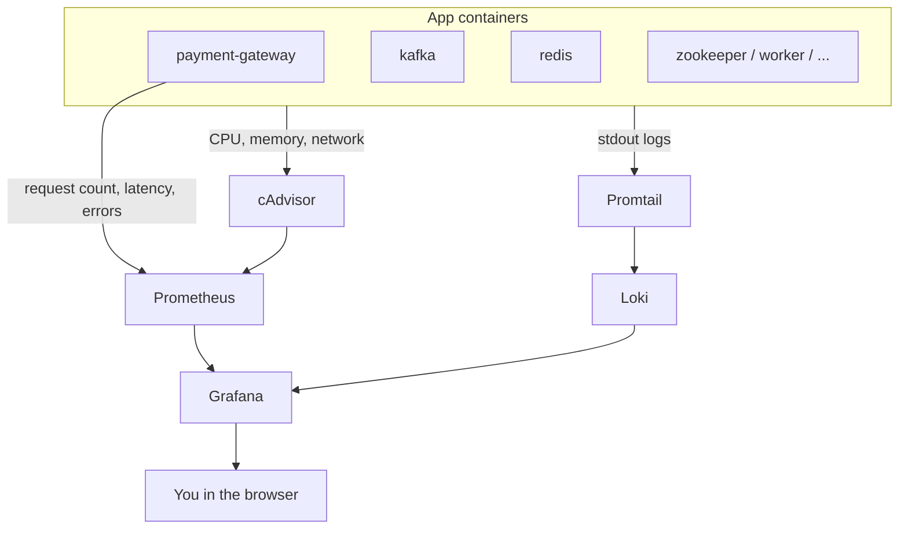

# Monitoring

This folder configures how we **watch** the app while it runs: graphs for performance, and a place to read logs.

Start the stack with:

```bash
docker compose up -d
```

Open **Grafana** in your browser to see everything in one place.

---

## Architecture



**Two paths, one screen:**

- **Numbers** → cAdvisor + app `/metrics` → Prometheus → Grafana (graphs)
- **Logs** → Promtail → Loki → Grafana (log search)

Grafana only **displays** data. It does not collect or store it.

---

## Why each piece

| Piece | What it does | Why we need it |
|-------|----------------|----------------|
| **cAdvisor** | Measures each Docker container (CPU, memory, network) | See if Kafka, Redis, or the gateway is under heavy load |
| **Prometheus** | Saves metrics every 15 seconds | Numbers need history over time; Grafana can't store them |
| **payment-gateway `/metrics`** | Counts requests, response time, errors | Container stats don't tell you how many `/pay` calls succeeded |
| **Promtail** | Reads container logs from Docker | Ships logs to the log store |
| **Loki** | Stores log lines | Search logs from all containers in one place |
| **Grafana** | Web UI for graphs and logs | One tool instead of jumping between terminals and URLs |

**Metrics vs logs:** metrics are numbers over time (e.g. "50 requests/sec"). Logs are text lines (e.g. "Payment failed: timeout").

---

## Useful URLs

| What | URL | Notes |
|------|-----|--------|
| **Grafana** | http://localhost:3000 | Main UI. Login: `admin` / `admin` (or anonymous if enabled) |
| **Prometheus** | http://localhost:9090 | Raw metrics DB. Check **Status → Targets** to see if scraping works |
| **cAdvisor** | http://localhost:8081 | Raw container stats |
| **Loki** | http://localhost:3100/ready | Log store health check |
| **payment-gateway metrics** | http://localhost:8000/metrics | App request stats (what Prometheus scrapes) |
| **payment-gateway API** | http://localhost:8000/docs | Send test payments (Swagger) |

Config files in this folder:

| File | Purpose |
|------|---------|
| `prometheus/prometheus.yml` | What Prometheus scrapes |
| `loki/loki-config.yml` | Where Loki stores logs |
| `promtail/promtail-config.yml` | How logs get from Docker to Loki |
| `grafana/provisioning/datasources/datasources.yml` | Auto-connects Grafana to Prometheus and Loki |

---

## Quick test

1. Start services: `docker compose up -d`
2. Send traffic: `python3 load-test/simulate.py --rps 10 --duration 10`
3. Open Grafana → **Explore** → pick **Prometheus** or **Loki**
4. Prometheus example: `rate(http_requests_total[1m])`
5. Loki example: `{container=~".*payment-gateway.*"}`

---

## Note (Docker Desktop on Mac)

cAdvisor metrics may use container **IDs** (`/docker/abc123...`) instead of friendly names like `payment-gateway`. That's a known Mac/Docker Desktop quirk. App metrics (`http_requests_total`) and Loki logs (`container` label) still use readable names.
